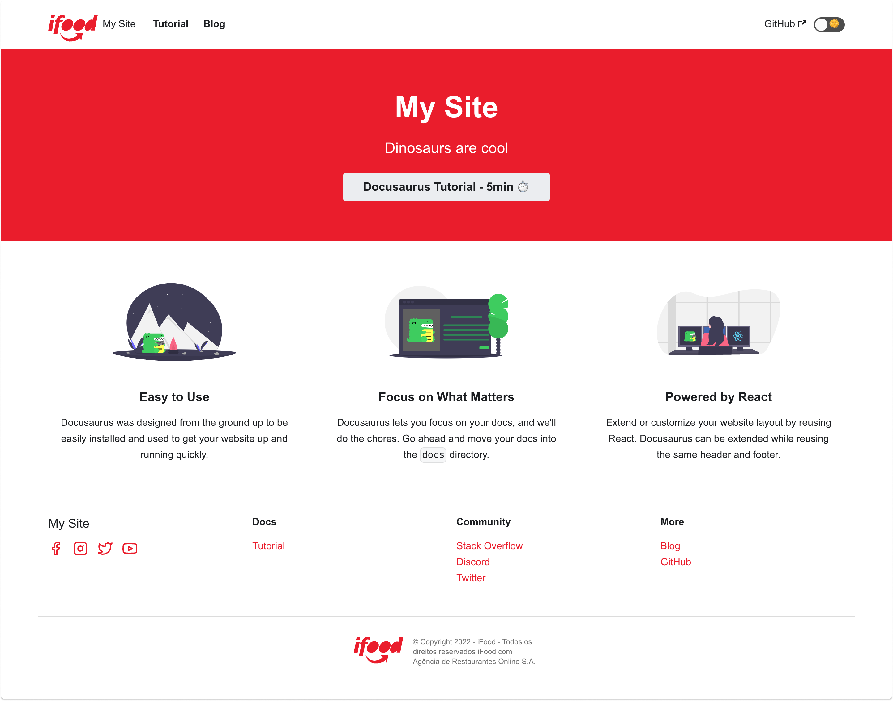

<h1 align="center">
  <a href="https://github.com/ifood/ifood-docusaurus-theme"></a>
  <p align="center">iFood Docusaurus Theme</p>
</h1>

[](https://www.npmjs.com/package/@ifood/docusaurus-theme)
[](https://github.com/prettier/prettier)

> iFood's official Docusaurus theme

## About

This project was created to provide a consistent experience trought iFood project's documentations using Docusaurus. It relies in [Swizzling](https://docusaurus.io/docs/swizzling) feature of Docusaurus, which allows deeper site customizations. Swizzling permits to swap a theme component with our implementation. Thanks to this feature and all customization given to us by the tool, we could easily create this theme.

> Note: It's currently unstable due the not full support to themes from Docusaurus. If there's any problem with the usage, please open an issue. 

### Preview

<p align="center">
  <a href="#preview"></a>
</p>

## Getting started

**Required**:  

- [Docusaurus](https://docusaurus.io/docs) >= 2.0.0
- [Node](https://nodejs.org/en/download/) >= 16.14.0

1. Install docusaurus 

> Due the unstable version of Docusaurus, we currently recomend use the version `2.0.0-beta.9`. We don't guarantee that the theme will work properly in other versions.

> The Docusaurus theme must be the `classic` in order to the customization work properly.

```bash
npx create-docusaurus@2.0.0-beta.9 [project-name] classic
```

2. Install the package

```bash
npm i @ifood/docusaurus-theme
```

3. Push the theme to the themes array in `docusaurus.config.js`

```js
...
projectName: 'docusaurus', // Usually your repo name.
themes: [
    '@ifood/docusaurus-theme'
],
presets: [
...
```

## Code of Conduct

iFood has adopted a Code of Conduct that we expect project participants to adhere to. Please read [the full text](https://github.com/ifood/.github/blob/main/CODE_OF_CONDUCT.md) so that you can understand what actions will and will not be tolerated.

## Contributing

Read our [contributing guide](CONTRIBUTING.md) to learn about our development process, how to propose bugfixes and improvements, and how to build and test your changes to the project.
## Examples

Example folder [here](./example/).
